# 
Elvira Espinoza Ahumada

[Click here to view the live web application](https://elvira-espinoza-50ffaf8a32fa.herokuapp.com/)

## Index - Table of Content

- [User Experience (UX)](#user-experience-ux)
- [Design](#design)
- [Technologies Used](#technologies-used)
- [Features](#features)
- [Feature Features](#feature-features)
- [Testing](#testing)
- [Deployment](#deployment)
- [Credits](#credits)

# User Experience (UX)
The goal of this website is to create a user-friendly platform where users can get information about Elvira, her specialties, treatment approaches, and contact details.This helps potential clients understand the therapist's expertise and decide if they are the right fit. At the same time, the site serve as a marketing tool to attract new clients thanks to the reviews that users can post, demonstrating the therapist's expertise and highlight their success stories.

## Project Goals

## Agile Methodology
This project was created using Agile principles via a projectboard on Github, where I was able to select which features were still to do, which features were in progress whilst being worked on, and which features met the definition of done. Labels were added to sort the issues based on the importance.
About the user stories, I created based on a Template, which acted as the skeleton for creating new user stories. Each user story would follow the convention:

**As a (role) I can (capability) so that (received_benefit)**

with their respective "Acceptance Criteria" which would need to be met in order for the User Story issue to be marked as Done. The acceptance criteria was very helpful to ensure all necessary tasks were completed, helping me to organise and prioritise my workflow. This has been essential due to the very limited timeframe we had to complete this project.

## MoSCoW Prioritization
I followed the MoSCoW Prioritization method for this project, with the following labels:

Must Haves: the 'required', critical components of the project. 

Should Haves: the components that are valuable to the project but not absolutely 'vital' at the MVP stage. The 'Must Haves' must receive priority over the 'Should Haves'.

Could Haves: these are the features that are a 'bonus' to the project, it would be nice to have them in this phase, but only if the most important issues have been completed first and time allows.

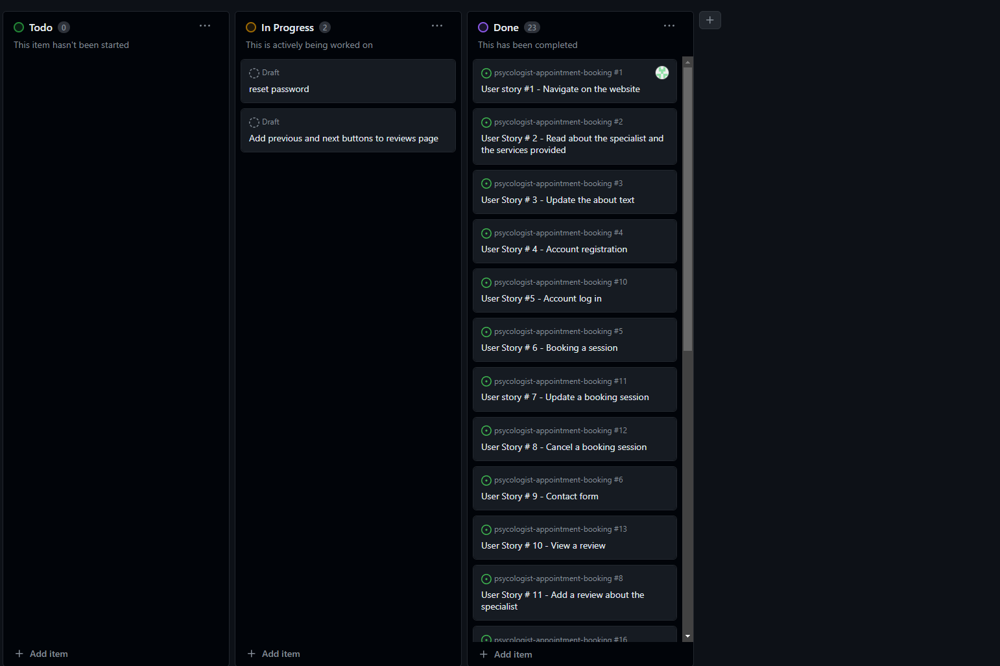

## User stories 

### Epics

- User registration and log in
- Home Page (Contact Form)
- Services 
- Booking appointments, edit and delete them
- Post a review 
- Admin Panel 
- Maintain consistent design with responsiveness in mind

| User Story | Priority |
|----------------------------------------------------------------------------------------------------------------------------------|-------------|
|  #1 |As a **User** I can **click on the About/services link** so that I can **read about the specialist and the services ofered**|**MUST HAVE**|
|  #2 |As a **visitor to the psychologist's website**  I want **to easily navigate to the page ** so that **I can have clear idea about the content and the booking system**|**MUST HAVE**|
|  #3 |As a **Admin** I can **update the about page content** so that **it is available on the site**|**COULD HAVE**|
|  #4 |As a **first-time user** I want to **create a new account** so it **can facilitate future bookings and leave a review**|**MUST HAVE**|
|  #5 |As a **registered user** I want to **log in with my credentials** so that **so I can access to my account.**|**MUST HAVE**|
|  #6 |As a  **user** I want **to see the availability of the psychologist ** so that **I can choose and book a convenient time slot**|**MUST HAVE**|
|  #7 |As a **user** I want to **see my booking list ** so that **I can reschedule an appointment**|**SHOULD HAVE**|
|  #8 |As a **user** I want to **see my booking list ** so that **I can delete an appointment**|**MUST HAVE**|
|  #9 |As a **user** I can **fill in a contact form** so that **I can submit a request for the specialist**|**MUST HAVE**|
|  #10 |As a **site user ** I can **view a paginated list of reviews ** so that **I can select which review I want to view**|**MUST HAVE**|
|  #11 |As a **user** I can **create reviews** so that **other users can read about other user’s experience**|**MUST HAVE**|
|  #12 |As a user I can **click on a review ** so that I can read the full text if it is a very long text**|**COULD HAVE**|
|  #13 |As a **Site Admin using the booking system** I want **to have a dashboard ** so that **I can manage my availability, view upcoming appointments, and block off time slots.**|**COULD HAVE**|
|  #14 |As a **site admin** I can **approve or delete reviews** so that **I can filter out objectionable reviews and manage my website content**||**MUST HAVE**|

# Design

## Color Scheme

The colours were selected with the intention of complementing the colors of the logo, in a mix of green and brown. The logo was provided by Elvira and the color have a special meaning for her, so I tried to maintain the color palette that she wanted, but also considering visibility and contrasts for a better user experience.

## Wireframes
Were created using Balsamiq. The sections below show individual wireframes for different devices:

- Home Page
The homepage has a hero image, a welcome section and a contact form, below the contact form there is a button "Read more about me!" that goes directly to the Services page. 

Click to View Home Page wireframes

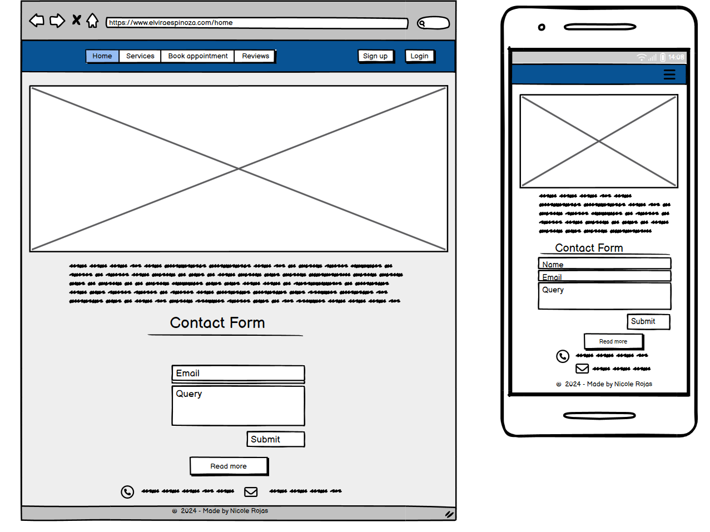

- About/Services
This page has 2 sections, one "About me" section where users can read about Elvira's mission and vision. 
The second section has a list of the services provided for the specialist and at the bottom of the page there is a button that users can click if they decided to go ahead booking an appoinment. In order to access to the booking page users need to sign in or register first. 

Click to View Services Page wireframes

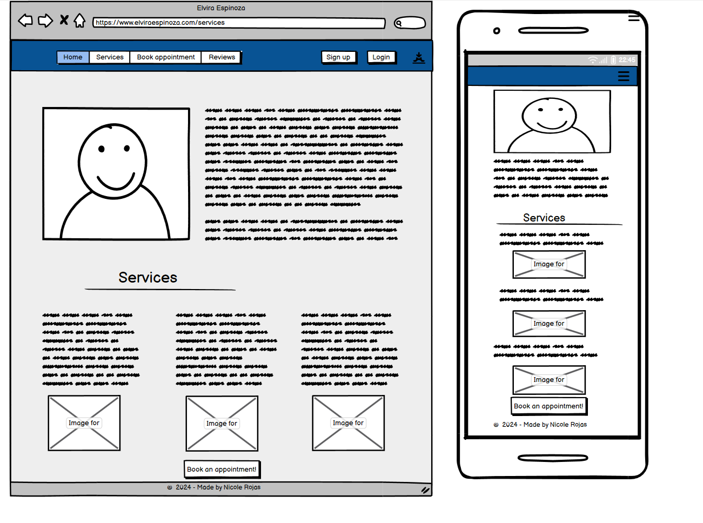

- Appointment page (Add an appointment)

Click to Add Bookings Page wireframes

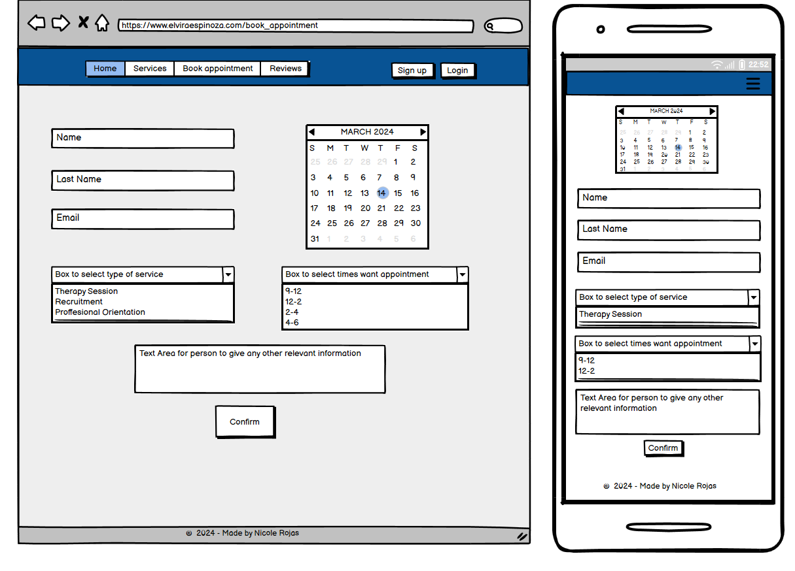

- Appointment page (Appointment list)

Click to View Appointment List wireframes

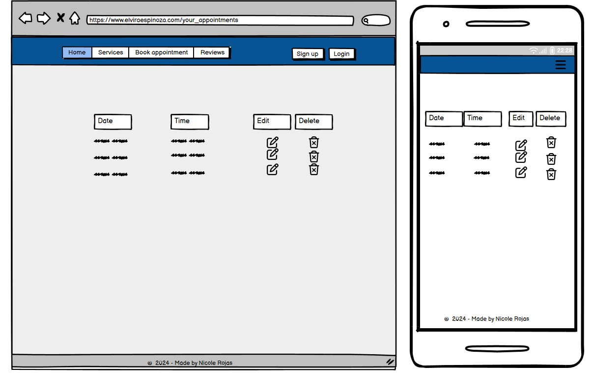

- Reviews page (Add a review)

Click to View Add Review Page wireframes

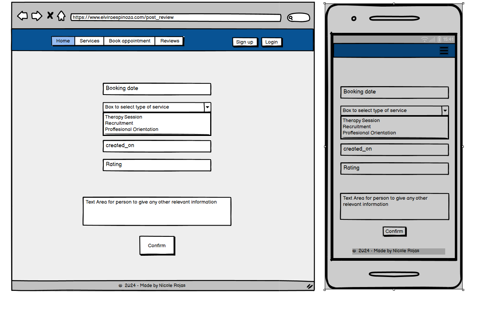

- Reviews page (Reviews list)

Click to Reviews list page wireframes

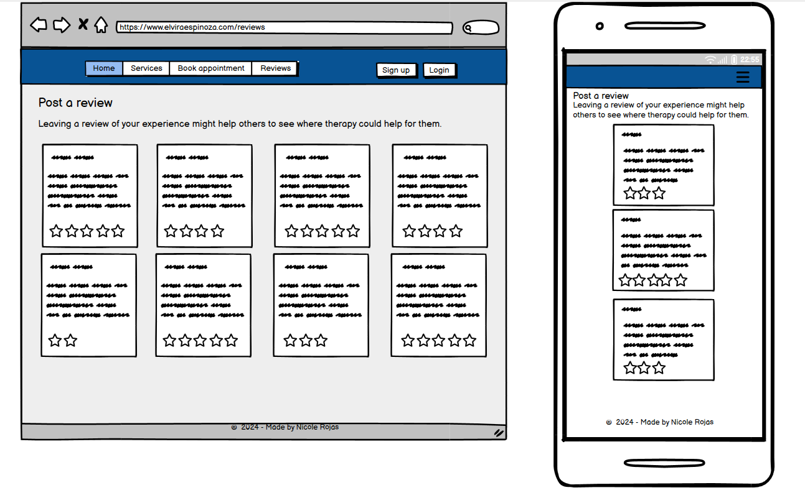

## Database Scheme
Entity Relationship Diagrams (ERD) help the developer to make connections between databases and information. Creating an ERD helped me understand how the tables relate to one another and their connection with PostgreSQL Database. I used LucidChart to create the diagram and the arrow represent how the data fields relate to one another.

My booking model and part of the design of my website was inspired  by the blog walkthrough by the Code Institute and the [FreeFido](https://github.com/amylour/FreeFido_v2) and the [thebookbooth1](https://github.com/hiboibrahim/thebookbooth1) projects during my learning of Django. They helped me to get a good and secure grasp of the templating structure and connected Python files to push my features further, make them my own and then develop my Review and Contact Models.

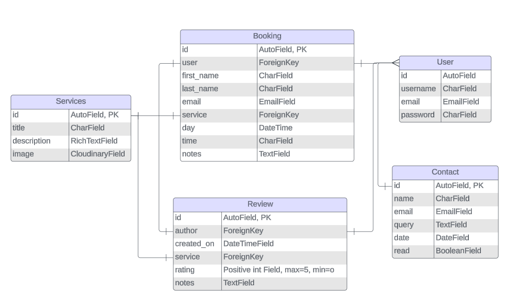

## CRUD
CRUD functionality was implemented in both booking courses and commenting where:

- Create: An authenticated user can create a booking or leaving a comment.
- Read: A user can read the course information and comments .
- Update: An authenticated user can edit and update their own booked courses or comments.
- Delete: An authenticated user can delete their own booked courses or comments.

In this proyect the feature "booking" has full CRUD functionality available whilst "reviews" allows users to CREATE and READ only. I felt unneccessary to add the option of UPDATE or DELETE a review since it is not common for users to return to a site to modify or delete a review. That functionality works better in blogs.  

Post can be deleted form Admin Panel. 

## Data Models

1. AllAuth User Model
- Django Allauth, the User model is the default user model provided by the Django authentication system
- The user can only post a review after having booked an appointment and only leave on review per booking date. 

| User|            |   |
|----------|:-------------:|------:|
| id |  AutoField |
| username |  CharField|
| email|  EmailField   |   
| password | CharField | 

2. Booking Model 
- A User can have multiple Bookings, but each Booking is associated with only one User. This is represented by the foreign key relationship between User and Booking.
- Full CRUD functionality is available to the user.

| Booking|            |   |
|----------|:-------------:|------:|
| id |  AutoField | PK|
| user |  CharField | FK
| first_name |  CharField   | 
| last_name | CharField |  
| email |  EmailField | 
| service|  CharField   |   FK |
| day | DateTime |    |
| time |  CharField |  |
| notes |  TextField |  |

3. Review Model
- Each user can post one review after booking an appointment. This is represented by the foreign key relationship between User and Review.
- Users can leave a review according to the service they booked. This is represented by the foreign key relationship between Service and Review.

| Review|            |   |
|----------|:-------------:|------:|
| id |  AutoField | PK|
| author |  CharField   |   FK |
| service|  CharField   |   FK |
| created_on | DateTime | 
| rating| Positive int Field, max=5, min=o   |   
| notes |  TextField |  |

4. Service Model 
- The service model is related with the Booking model and the Review model, users can select a service at the momoent of booking an appointment 
- Users can post a review based in the type of service received (Online consultation, Individual or family therapy and workshops)

| Service|            |   |
|----------|:-------------:|------:|
| id |  AutoField | PK|
| title |  CharField   |   
| description|  RichTextField   |
| image | CloudinaryField | 

5. Contact Model 
- This model recieves the post requests and saves the data in the database, represented by the foreign key relationship between User and contact form. 

| Contact|            |   |
|----------|:-------------:|------:|
| id |  AutoField | PK|
| name |  CharField   |   
| email|  EmailField   |   
| query |TextField| 
| date | DateField|
| read|BooleanField  |   

### Allauth User Model
The User model was built using Django's Allauth library

**All Users:**
- Are able to view the services provided for the specialist and a list of reviews from other users

**Registered Users Only:**
- Can book and appointment
- Can create, read, udpate and delete an appointment from their personal dashboard  (Front End CRUD functionality)
- Can post a review, but only after they have scheduled an appointment.

# Technologies Used

## Languages

- [HTML](https://en.wikipedia.org/wiki/HTML5) - used for the main site content.
- [CSS](https://en.wikipedia.org/wiki/CSS) - used for the main site design and layout.
- [Python](https://en.wikipedia.org/wiki/Python_(programming_language)) - used as the back-end programming language.
- [JavaScript](https://en.wikipedia.org/wiki/JavaScript) - used for user interaction on the site for automatically closing 
Django Messages and to handle the notification dropdown and notification delete functions.   

## Frameworks, Libraries and  Tools

- [Am I Responsive](https://ui.dev/amiresponsive) - Used to verify responsiveness of website on different devices.

- [Bootstrap v5.3.2](https://getbootstrap.com/) - Used to help with the responsiveness of the site and to aid the coding of some of the layout

- [Balsamiq](https://balsamiq.com/) - Used to create the wireframes during the design process

- [Cloudinary](https://cloudinary.com/) - Used for online static file storage.

- [Django](https://www.djangoproject.com/)- Used as the Python framework for the site.

- [ElephantSQL](https://www.elephantsql.com/) - Used as the Postgres database.

- [Favicon.io](https://favicon.io/) - Used to create and add the favicon to the browser tab

- [Font Awesome](https://fontawesome.com/) - Used to add icons to the site for aesthetic and UX purposes.

- [GitHub](https://github.com/) - Used to store the project code after being created in GitPod 

- [Gitpod](https://www.gitpod.io/) - Used to create, edit & preview the project's code

- [Google Fonts](https://fonts.google.com/) - Used to import the 'xxxxxxxxxxxx' and 'xxxxxxxxxxxxxxx' fonts into the style. 
css file which are used on all pages of the project.

- [Heroku](https://dashboard.heroku.com/)- Used for hosting the deployed back-end site.

- [PostgreSQL](https://www.postgresql.org/) - Used as the relational database management.

- [Markdown Builder by Tim Nelson](xxxxxxxxxxxxx) - Used to help generate the Markdown files.

- [W3C](https://www.w3.org/) - Used for HTML & CSS Validation.

- [WAVE](https://wave.webaim.org/) - Used for Accessibility evaluation.

# Features

## Nav Menu 
- The navigation bar appears on every page so users can easily navigate through the site and it is also fixed, so users don't need to go back to the top of the page is they want to move to a different page.

- When the user hasnt log in, the nav bar will display links for 'ELVI your psychologist!' (Home page), 'Services', 'Reviews',  and 'Login/Register'

- If the user is logged in, then the left side of the menu will show links for pages that only authorized users can visit and use, they are: 'Book an appointment' and a dropdown menu when the user name and links for 'Your Bookings', 'Add a Review' and 'Logout'. Otherwise, the user will be given the option to 'Register' or 'Login'

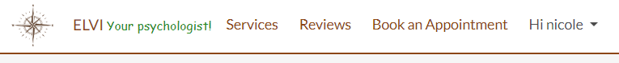

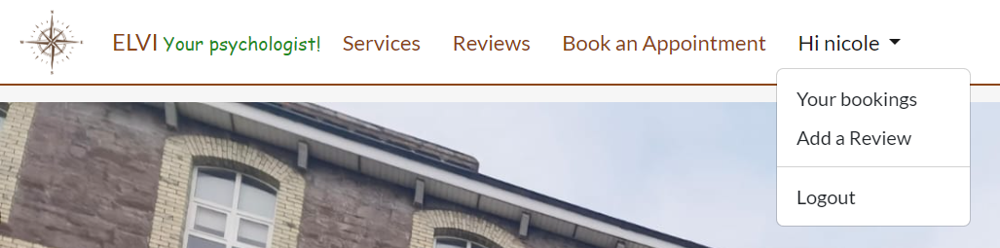

- The navbar is fully responsive, collapsing into a hamburger menu for medium and small screen size

## Hero Image

-Hero Image shows a large image of Elvira, which was chosen by her, and which represents the style of psychology that she practices, in an environment of trust and relaxation. 

## Contact Form
- 

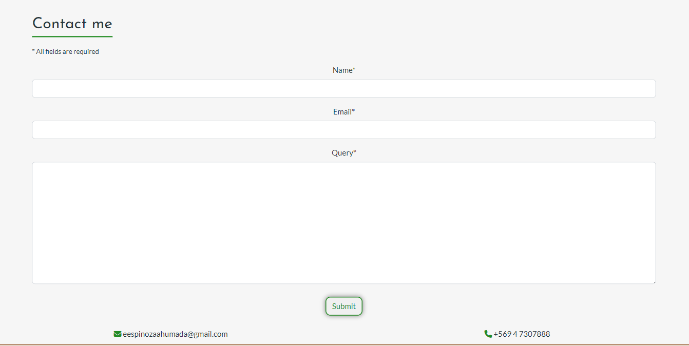

## Footer
- Just like the nav bar, the footer appears on every page and provides links to respective social media pages.
- Links are opened in a new tab to avoid dragging users from our site

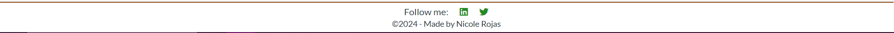

---------------

## Sign Up Page

- Registration allows users to book and appointment with the therapist and also post a review after their booking. Users are required to add their Email, Username and Password twice, to ensure the correct one is saved. If any field is not filled in appropriately then a display message is used to inform the user with how to procede to complete the form.

- A 'Forgot Password' page is also re-designed from the AllAuth templates but it's full functionality is not yet activated for this version.

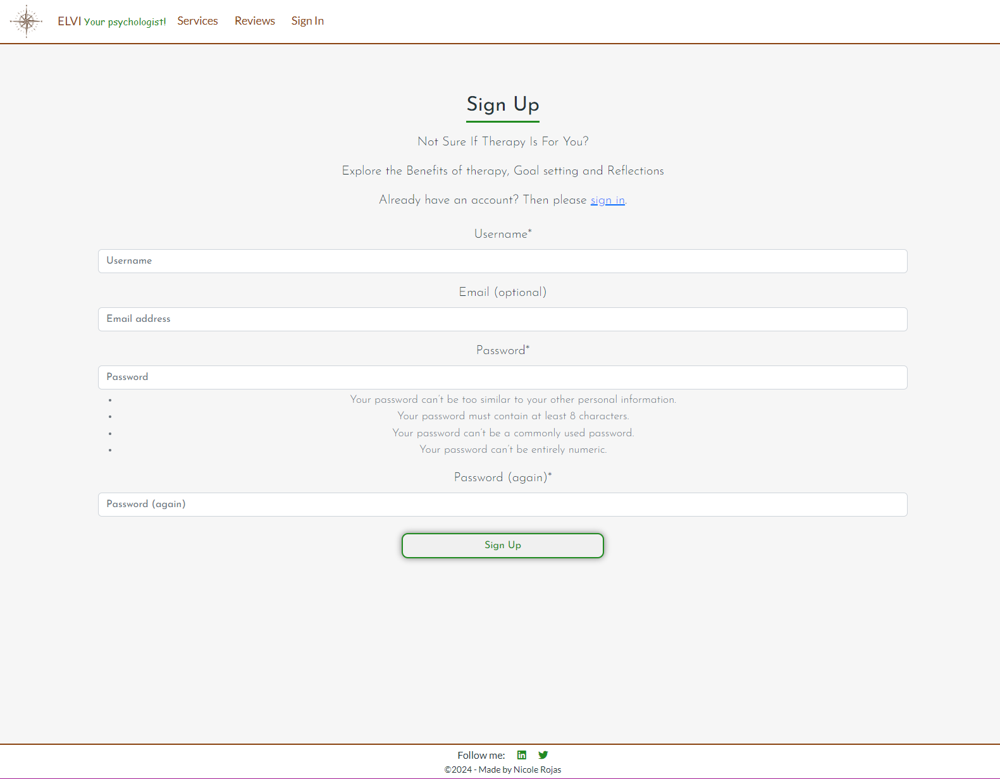

## Login Page

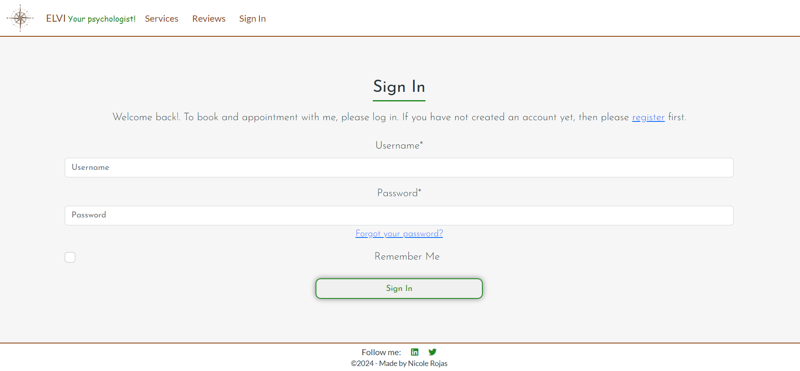

## About section 

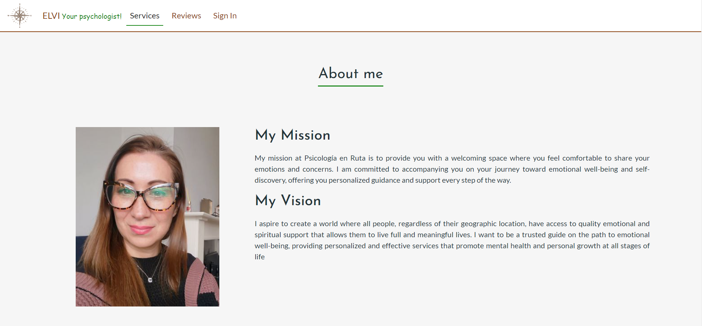

## Services section 

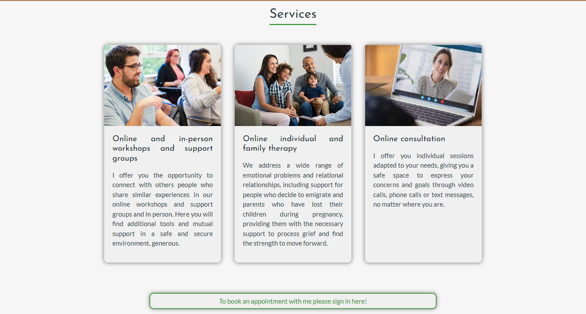

## Book and appointment 
- This page contain a simple form with a section for user details and anoter section for choose date and time. All fields are required: First Name, Last Name, Email and Service (online consultation, individual/family therapy and Workshop).
- There is no limit for bookings, users can book as many apoointment as they want.  
- The user may create, edit and delete their bookings, they are informed if a date/time is unavailable and they see a display message if their booking is saved.
- For creating a booking, the user is informed of the necessary fields to be filled in (*)
- A dropdown selection of 'Services' is available. This information is important for later, in case the user wants to post a review, it would be associated to the booking date and the serviced booked. Unfortunately, that part of the model is not 100% implemented for this version. 
- Date and time is selectable via a calendar widget for date and dropdown selection menu displaying the hour slots from 9am to 6pm. 
- If a date/time combo is unavailable then the user is informed via warning message. 
- User feedback is delivered by message once a booking has been submitted and updated, message disappears after 5 seconds. 

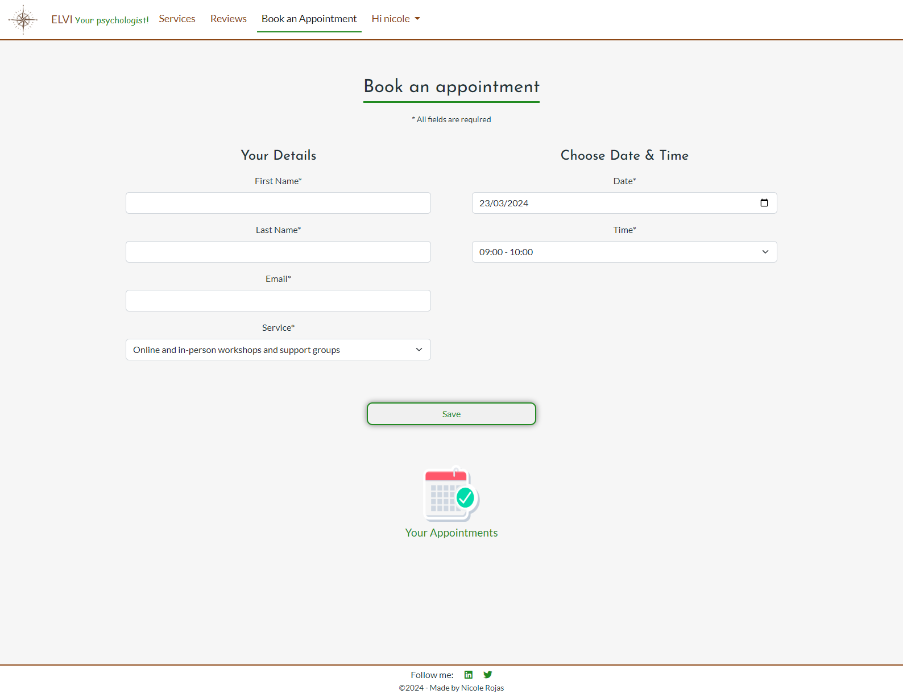

## List of user's appointments
- Dashboard only visible for Logged-In Users who have made a previous booking
- Below the list of appointments the user will find an icon to post a review (next to the icon it is also possible to see a paragraph that indicates "post a review" for better accessibility for all users).

## Edit appointments
- When logged in, a edit icon will appear to allow users to modify and update their bookings if they wish.

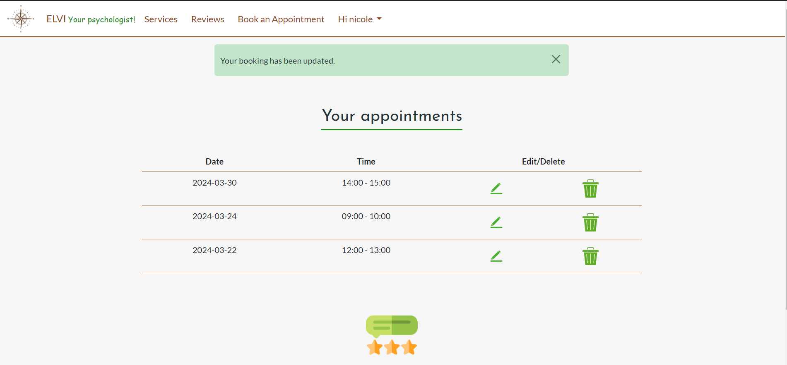

## Delete appointments
- When logged in, a trash icon will appear to allow users to delete their bookings if they wish.
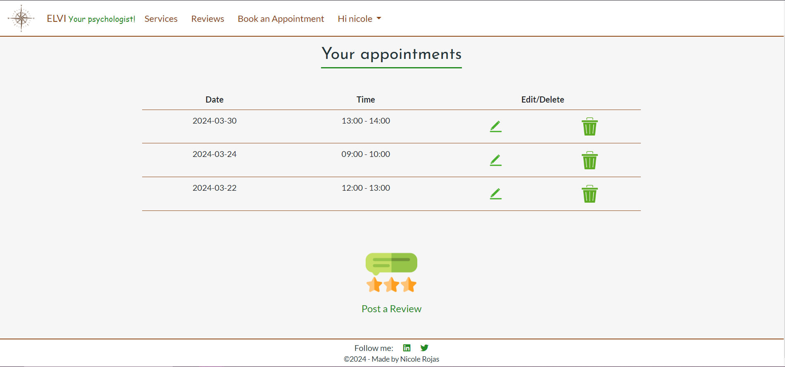

## List of the latest reviews
- The Reviews page shows all the reviews that have been posted by different users, and are shown in order from newest to oldest
- Each review card will display the author's name, date posted, the service booked, a body section for the comments and a rating scale 1 to 5 represented for stars

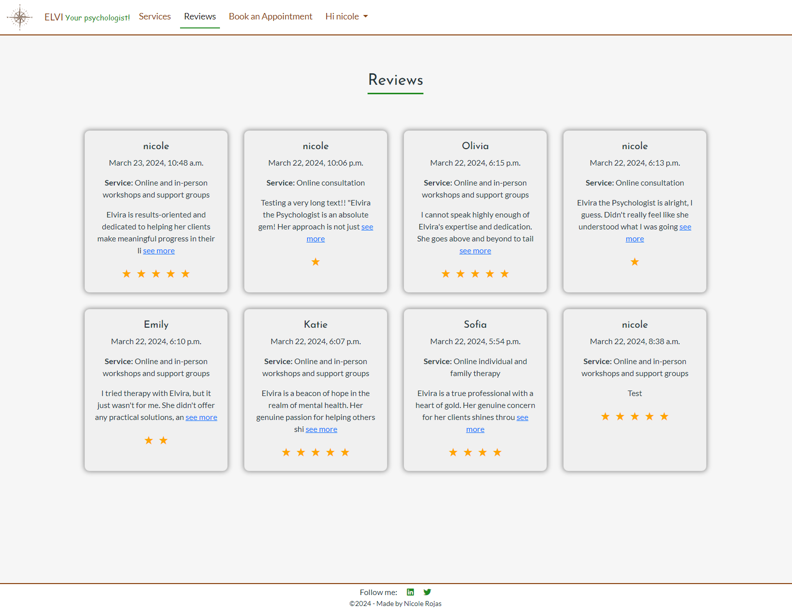

- If the body section for comments that exceeds a certain amount of characters , users will see a "see more" hyperlink that will allow them to display the complete content in a new window, favoring a better visualization of the content.

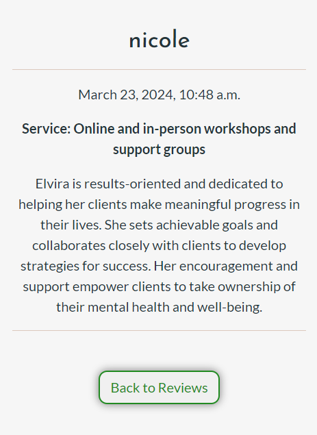

## Add a review
This page contain a form with details of: booking date, service, date, rating and a comment. All fields are requested for submit the form.

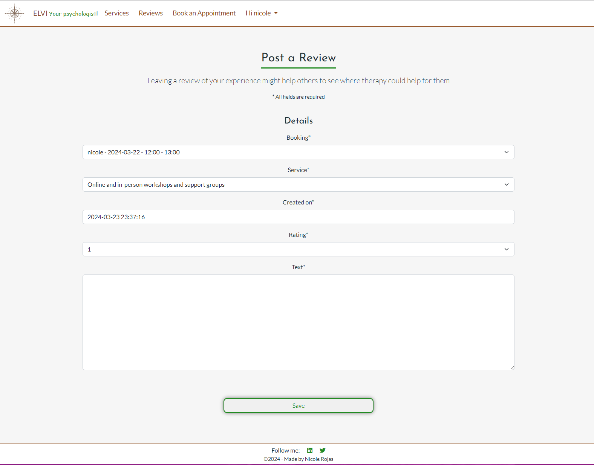

## Log Out
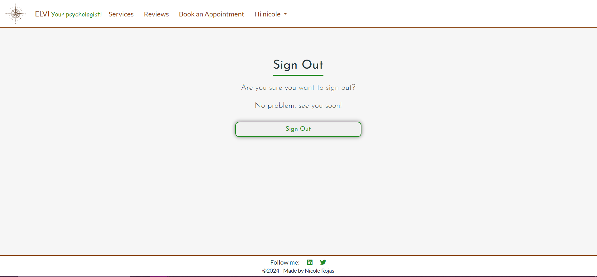

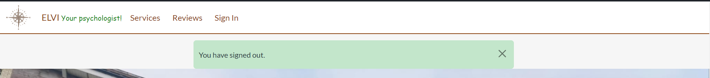

## Admin Panel

- To access the Admin panel the Admin user adds '/admin/' to the end of the URL to display https://elvira-espinoza-50ffaf8a32fa.herokuapp.com/admin/. A username and password is requested. For this project, Admin approval is not needed so registered, logged-in users' have instant access to make a booking and post a review.

- Admin can control users bookings, reviews and contact requests via the Django Admin panel.

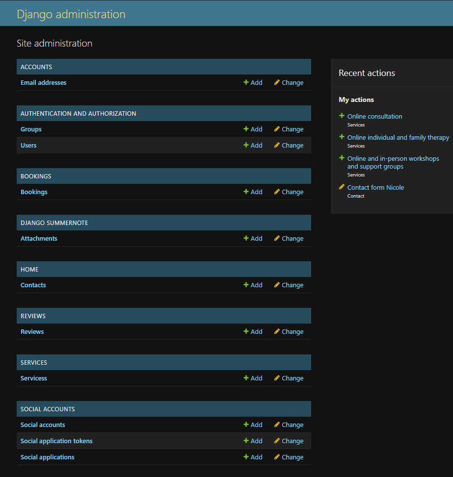

# Feature Features
This is definitely a project I want to revisit in the future and add some extra features like:

- Updated Booking system with a calendar that shows only the available days. The same idea with the available times. Considering that Elvira always has a full schedule, a better experience for the user would be to be able to see only the available hours displayed in the dropdoen menu so they wouldn't have to check one by one and receive "Day not available" messages all times.

- Filter the services that were scheduled on each date for a more personalized review. My mentor explained to me that code require a little more knowledge, because it is generated dynamically. This is something that I really want to learn to incorporate in another opportunity

- Pagination Reviews page. 
Depending on the number of reviews that are added to the page, it would be convenient to have the option of seeing only 6 or 8 reviews per page so users don't to scroll down so much, generating a better user experience.

- Enable the option to reset password

- A blog that allows Elvira to upload diverse content such as articles, videos, podcasts and share personal anecdotes or success stories among others. At Elvira's request, this blog does not include the option for the user to add comments.

# Testing

## Validator testing

The website was tested using the tools made available by the World Wide Web Consortium, also known as "W3C".

The two tools used were the Markup Validation Service and the CSS Validation Service. Both tools were used to test the website by URL and also by direct input, with the results shown below.

No errors were returned for all HTML or CSS across all tests. Some warnings were displayed.

- HTML Validation by Direct Input

     
- CSS Validation by Direct Input

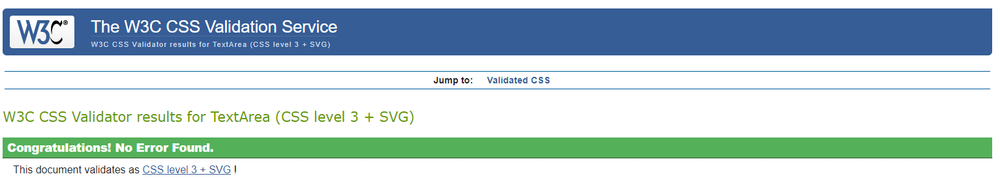

## Manual testing

The site was tested manually across a range of devices to ensure all links and styling work correctly and to ensure responsiveness across a range of devices. All features on the page were tested, to ensure functionality was not impacted in any way. 

#### Account Registration Tests
| Test |Result  |
|--|--|
| User can log in | Pass |
| User can log out  | Pass |
| Messages are displaying | Pass |
| Messages are dismissable by button and timeout | Pass |

#### User Navigation Tests

| Test | Result  |
|--|--|
| User can easily navigate to the wesite | Pass |
| User can access services page| Pass|
| User can access reviews page| Pass|
| User can access booking page| Pass|
| User access their dashboard booking page|Pass|
| User can fill and send a contact form |Pass|
| SuperUser can access admin page|Pass|

#### Account Authorisation Tests

| Test | Result  |
|--|--|
| Only Superuser can access admin page |Pass|
| Non authorised user  won't access add booking page| Pass |
| Non authorised user won't access add review page| Pass|

#### Booking Tests

| Test |Result  |
|--|--|
|User can make a booking | Pass |
|User can view all of their bookings | Pass |
|User can edit booking | Pass |
|User can delete their booking | Pass |
|User can make more than one booking | Pass |

#### Review Tests

| Test |Result  |
|--|--|
|User can post a review | Pass |
|User can view a list of the latest reviews | Pass |
|User can view a review in detail  | Pass |

## Browser Compatibility

Testing was carried out on multiple browsers such as Google Chrome, Microsoft Edge, Mozilla Firefox, Brave,  Safari and Opera. Testing was carried out on an Apple iPhone, Apple iPhone 13, Samsung Galaxy S20 FE, Samsung Galaxy A51 and Apple iPad Pro.

## Lighthouse Testing

A test in all pages was ran using Lighthouse within Google Chrome to verify performance and accessibility standards were met and to ensure best practices were followed.

### Homepage
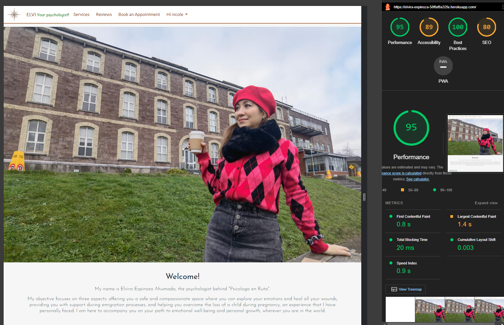

### About / Services page
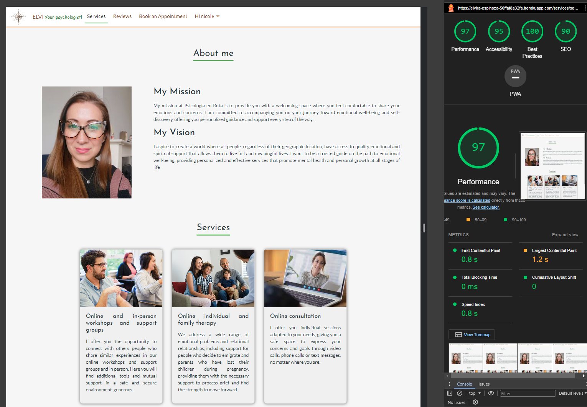

### Book and appointment page
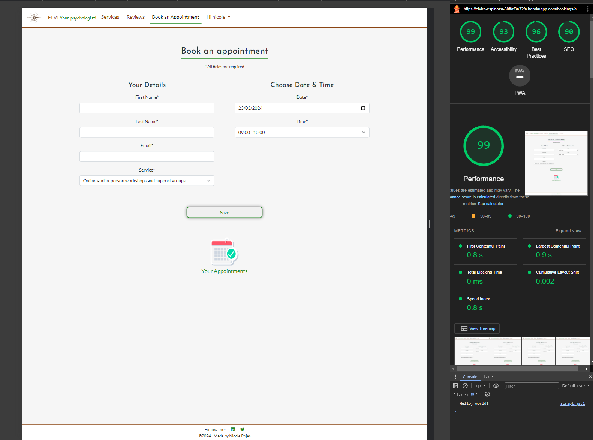

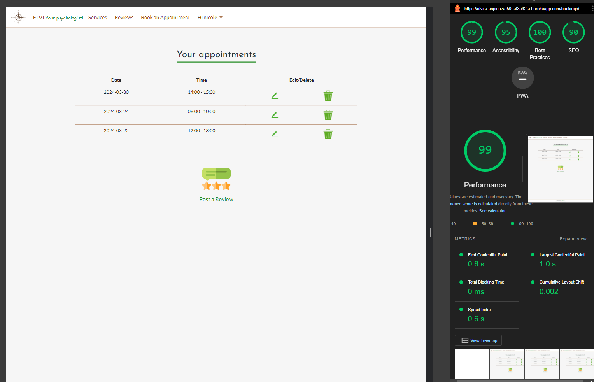

### Reviews page

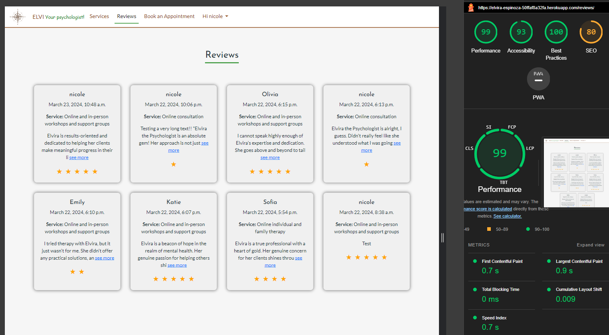

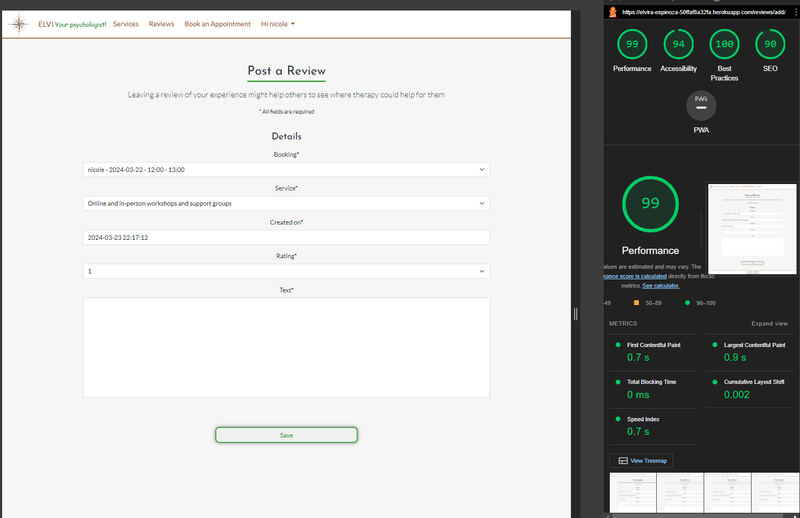

# Deployment 
This project was deployed using Github and Heroku.
The live deployed application can be found deployed on [Heroku](https://elvira-espinoza-50ffaf8a32fa.herokuapp.com/).

## Local Deployment
This project can be cloned or forked in order to make a local copy on your own system.

### Forking the GitHub Repository
You can fork the repository by following these steps:

1. Go to the GitHub repository
2. Click on Fork button in upper right hand corner

### Cloning the GitHub Repository

You can clone the repository to use locally by following these steps:

1. Navigate to the GitHub Repository you want to clone
2. Click on the code drop down button
3. lick on HTTPS
4. Copy the repository link to the clipboard
5. Open your IDE of choice (git must be installed for the next steps)
6. Type git clone copied-git-url into the IDE terminal

The project will now be cloned locally for you to use.

### ElephantSQL Database
This project uses ElephantSQL for the PostgreSQL Database.

To obtain your own Postgres Database, sign-up with your GitHub account, then follow these steps:

Click Create New Instance to start a new database.
Provide a name (this is commonly the name of the project: tribe).
Select the Tiny Turtle (Free) plan.
You can leave the Tags blank.
Select the Region and Data Center closest to you.
Once created, click on the new database name, where you can view the database URL and Password.

### Cloudinary API
This project uses the Cloudinary API to store media assets online, due to the fact that Heroku doesn't persist this type of data.

To obtain your own Cloudinary API key, create an account and log in.

1. For Primary interest, you can choose Programmable Media for image and video API.
2. Optional: edit your assigned cloud name to something more memorable.
3. On your Cloudinary Dashboard, you can copy your API Environment Variable.
4. Be sure to remove the CLOUDINARY_URL= as part of the API value; this is the key.

### How to run the project locally 
Once the project is cloned or forked, in order to run it locally, you'll need to follow these steps:

1. Install any applicable packages found within the requirements.txt file.
pip3 install -r requirements.txt. 

If you have your own packages that have been installed, then the requirements file needs updated using:
pip3 freeze --local > requirements.txt

2. Create a new file called env.py in the main directory.
3. Add the DATABASE_URL value and your chosen SECRET_KEY and the Cloudinary URL to env.py file.
4. Comment out the default database configuration.
5. Add the Cloudinary and all the rest of libraries you need to the list of installed apps in settings.py
6. Add the STATIC files settings - the url, storage path, directory path, root path, media url and default file storage path.
7. Link the file to the templates directory in Heroku.
8. Change the templates directory to TEMPLATES_DIR
9. Add Heroku to the ALLOWED_HOSTS list the format ['app_name.heroku.com', 'localhost']
10. Save all files and make necessary migrations. 
python3 manage.py makemigrations
11. Migrate the data to the database:
 python3 manage.py migrate
12. Create a superuser: 
python3 manage.py createsuperuser

Everything should be ready now, so run the Django app again: 
python3 manage.py runserver

### Heroku Deployment
This project uses Heroku, a platform as a service (PaaS) that enables developers to build, run, and operate applications entirely in the cloud.

Deployment steps are as follows, after account setup:
Make sure DEBUG = False in the settings.py

Heroku needs two additional files in order to deploy properly.

Create a new file in the main directory called Procfile (do not use any extension for the name of this file)
The Procfile can be created with the following command:

echo web: gunicorn app_name.wsgi > Procfile
replace app_name with the name of your primary Django app name; the folder where settings.py is located

1. Select New in the top-right corner of your Heroku Dashboard, and select Create new app from the dropdown menu.
2. Your app name must be unique, and then choose a region closest to you (EU or USA), and finally, select Create App.
3. From the new app Settings, click Reveal Config Vars, and set your environment variables.
(Add table with keys!!)

Go to the deploy tab on Heroku and connect to GitHub, then to the required repository. 

Scroll to the bottom of the deploy page and either click Enable Automatic Deploys for automatic deploys or Deploy Branch to deploy manually. Manually deployed branches will need re-deploying each time the GitHub repository is updated.
Click 'Open App' to view the deployed live site.

The project should now be connected and deployed to Heroku!

# Credits

- Thank you to my mentor Chris Quinn for his positive support, guidance and advice.
- Thanks to my classmates and friends, and Code Institute's Slack community for their teaching and support.
